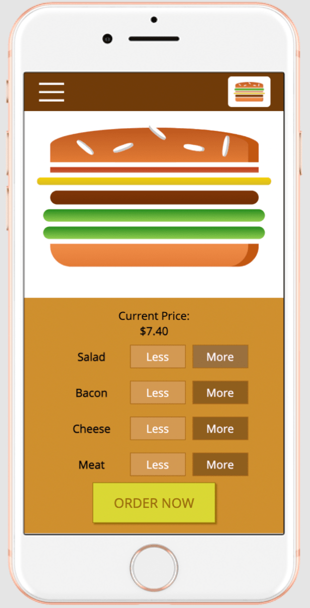
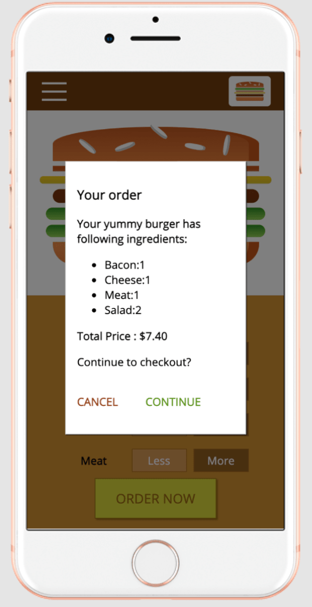
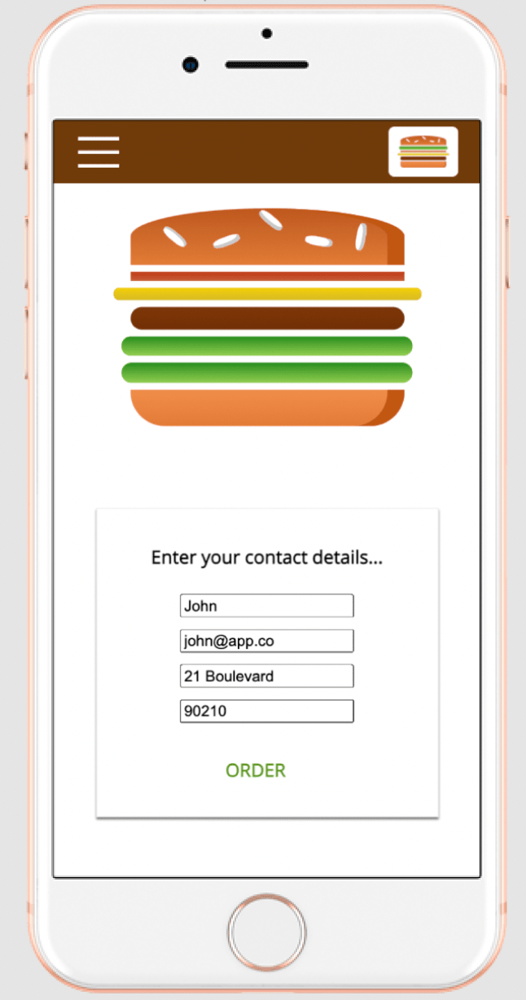
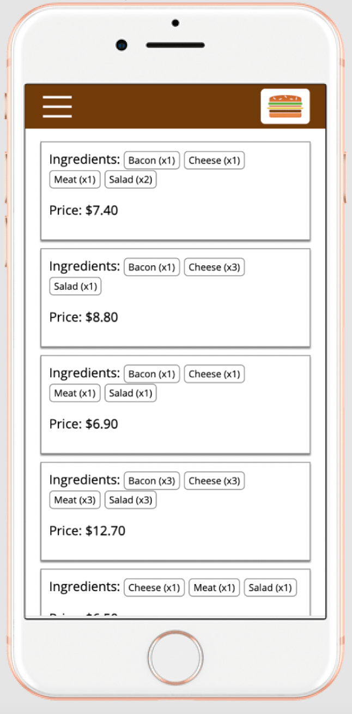

# Burger Creator App 1.0

## [Legacy] ReactJs class-based

This simple 3 page web-app was created to brush up old (pre-v16) Class-based components and API's concepts of ReactJs.

Special thanks to Maximilian Schwarzmüller(instructor) from whom I learnt React(Complete course) which is available on Udemy.

## Features

  
  
  
  

- WYSIWYG editor of burger - Adding/Subtracting ingredients with visualization.
- Checkout and communicating with backend (Firebase) upon Order completion.
- Modals, confirmation dialogs and overlaying Sidebars (Mobile)
- Mobile-first, Responsive with a breakpoint at 500px.
- Order ingredients config, and Order history fetched from FireBase (Real-time database).
- CSS Modules (config included in create-react-app).
- Routing done using react-router-dom.
- Modules created - Presntational components (UI-Modals/Backdrop/Logo, Burger, Navigation, Orders) and Container components (Orders, Builder, Checkout)

## License
MIT
